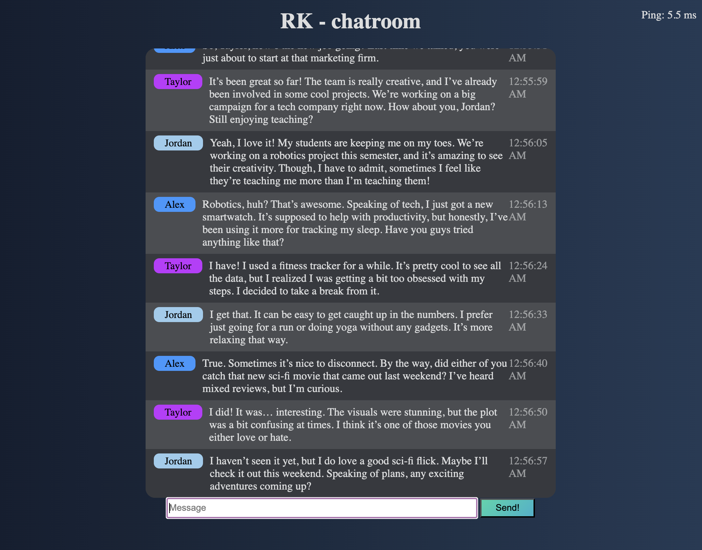

# rk-chatroom

**INSTALLING NECCESARY PROGRAMS**

in order to run please install git (to download the repository)

    brew install git

if you do not have homebrew installed you will need to do it here[https://brew.sh/]

in summary you will need to execute the following commands:

    /bin/bash -c "$(curl -fsSL https://raw.githubusercontent.com/Homebrew/install/HEAD/install.sh)"
    
Since this is a python you should have python 3.9 or newer installed
SKIP THIS STEP IF YOU ALREADY HAVE PYTHON LOCALLY INSTALLED

    brew install python

    

    
    
**INSTALLING**
    
    

**Next we will be installing this onto our computer**

please execute the following command:

    git clone https://github.com/rkalesalad/rk-chatoom
    
once it is installed locally you can remote into it by executing the command

    cd rk-chatroom

install the neccesary modules and dependencies once in the chatroom folder

    pip install -r requirements.txt
  
**RUNNING AND USE**

You will need your IPV4 so get it by entering this into command line:
mac users:
        
    ipconfig getifaddr en0

windows users:

    ipconfig/all

Run the commmand to activate the program

Set the app.py as the default flask_app

     FLASK_APP=app.py

**REPLACE THE IP WITH THE IPV4 YOU GOT EARLIER**
     
     flask run --host=0.0.0.0

     
     

navigate to the ip you set in your browser with :5000 at the end (thats the prot number) (EX: in my case i set it to http://10.1.10.77:5000/)